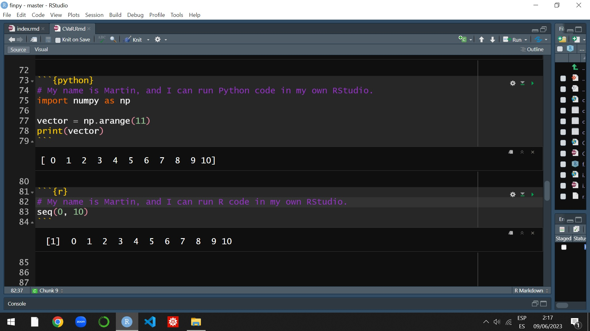

\newpage

# `r fontawesome::fa("code")` Data science.

Data science is the study of extracting generalizable knowledge from data. Being a data scientist requires an integrated skill set that encompasses operations research, statistics, and computer science, along with a solid understanding of formulating problems in specific fields to achieve effective solutions. This course aims to introduce you to this rapidly growing field and equip you with its basic principles, tools, and general mindset within the context of business. Ideally, you will learn to apply financial and economic concepts, models, techniques, and tools to analyze various aspects of data science practice. This includes data collection and integration, exploratory data analysis, descriptive and predictive modeling, visualization, evaluation, and effective communication. For a comprehensive introduction to the application of data science in finance, I recommend referring to @hull2020machine.

In this course, the goal is not to become a data scientist, but rather to lay the foundation for further specialization in this field through postgraduate studies. Nowadays, many undergraduate students recognize the need for basic knowledge in data science and machine learning to thrive in a world where these areas have an increasing impact on job opportunities. In the past, computer literacy was essential for all executives. Today, executives are expected to be comfortable managing large datasets and collaborating with data science professionals to drive innovation and enhance productivity.

Learning these computational skills aligns with the purpose of developing STEAM (Science, Technology, Engineering, Arts, and Mathematics) skills during your undergraduate studies in business. For more information on STEAM skills, you can refer to @boon2019exploring. In my opinion, learning opportunities for undergraduate students should include authentic tasks that are grounded in real-world business contexts. Authentic tasks typically involve ill-defined problems, complex or multi-step questions, multiple approaches to problem-solving, and sub-tasks that integrate across disciplines. This course incorporates some of these STEAM principles and ideas into various learning activities.

Data science has a strong connection with finance and economics. In this course, we will explore the integration of data science concepts and tools within the context of *digital humanities*. Digital humanities is an interdisciplinary field that encompasses research, teaching, and innovation at the intersection of computing and various humanities disciplines, including economics and finance. It is inherently methodological and encompasses the investigation, analysis, synthesis, and presentation of information in electronic form. Digital humanities studies the impact of these digital media on the disciplines in which they are utilized and examines the contributions of these disciplines to our understanding of computing. If you are interested in delving deeper into the concept of digital humanities and exploring the ongoing vibrant discussions in this field, I recommend referring to @klein2019debates. Additionally, to gain insights into data science and data ethics informed by the principles of intersectional feminism, which aligns with the fifth [United Nations Sustainable Development Goal](https://sdgs.un.org/goals) on gender equality @UN17, you may find @d2020data to be a valuable resource.

To learn more about the 17 [United Nations Sustainable Development Goals](https://sdgs.un.org/goals):

```{r echo=FALSE}
embed_url("https://youtu.be/5G0ndS3uRdo")
```

## `r fontawesome::fa("r-project")` `r fontawesome::fa("plus")` `r fontawesome::fa("python")`.

R is a programming language and free software environment designed for statistical computing and graphics. It is supported by the [R Foundation for Statistical Computing](https://www.r-project.org/foundation/) and widely utilized by statisticians and data miners for developing statistical software and performing data analysis. Python, on the other hand, is an interpreted, interactive, and object-oriented programming language. It incorporates features such as modules, exceptions, dynamic typing, high-level dynamic data types, and supports multiple programming paradigms including procedural and functional programming.

```{r echo=FALSE}
embed_url("https://youtu.be/9kYUGMg_14s")
```

Getting started with R and Python has become increasingly accessible due to the abundance of free resources available on the Internet. This includes Artificial Intelligence (AI) tools. All it takes is dedicating the right amount of time and effort to learn these languages. The perceived difficulty of computer programming is often a significant barrier for some individuals, but once they realize that it is not as challenging as they initially thought, their progress improves significantly.

This course integrates data science, data analysis, and computational finance using R, @Rcitation and Python as the primary tools. As a result, you will have the opportunity to learn or further enhance your coding skills, which will enable you to apply economic and finance models in practical scenarios. It is important to note that this course is not primarily focused on computer science, and therefore we have limited time to cover mandatory finance-related material. To overcome this limitation, you will engage in hands-on assignments, collaborate with your peers, use AI specialized tools, and utilize online resources such as [Swirl](https://swirlstats.com/) lessons and/or [DataCamp](https://www.datacamp.com/) courses to learn R and Python.

```{r echo=FALSE}
embed_url("https://youtu.be/4lcwTGA7MZw")
```


There are various approaches to learning basic data science and developing the ability to transform information into valuable business intelligence. Learning to code is one method that I highly recommend. Coding allows you to train your brain to think more efficiently and productively, enabling you to tackle complex problems and generate innovative solutions. In today's finance job market, there is a growing demand for candidates with knowledge in the field of data science or computational finance. This is primarily because such expertise enhances creative problem-solving skills and proficiency in data analysis.

Listen to Steve Jobs:

```{r echo=FALSE}
embed_url("https://youtu.be/BRTOlPdyPYU")
```

I understand that learning programming may seem challenging and frustrating at first for some people. If this is your case, I want to assure you that it is not as difficult as it may initially appear. In fact, it can be an incredibly rewarding experience that opens up a whole new world of possibilities. By learning programming languages like R and Python, you will gain access to free and open-source software that is supported by a generous online community. This community is always ready to assist and provide guidance, making your learning journey much easier. Additionally, you will discover the incredible advancements in scientific document production that come with these tools, offering limitless possibilities compared to commercial software.

## `r fontawesome::fa("lock")` Commercial alternatives.

Throughout your undergraduate studies, you will be expected to acquire proficiency in various commercial software programs, such as Microsoft Excel, SPSS, STATA, E-Views, and many others. I strongly encourage you to develop your skills in these programs, particularly if their usage is required by your professor. However, it is crucial to recognize that these programs are owned by private firms and primarily focused on generating value for their shareholders. Consequently, there is no guarantee that the associated file formats will remain accessible or even exist in the future, which can adversely impact reproducibility.

While I will never discourage you from learning commercial software programs like the ones mentioned above, I also want to emphasize the alternative option of learning and utilizing user-oriented computer languages, such as R or Python, for conducting rigorous data analysis in the fields of economics and finance. These languages are supported and continuously enhanced by a large and active scientific community, providing a plethora of online resources to support eager beginners like yourself.

Commercial software products like the ones mentioned above are undoubtedly important in the job market. However, it is crucial to recognize that the primary interaction with these programs relies on using a mouse to navigate through pre-defined, limited, and inflexible menus. This type of user interaction is often fleeting and unrecorded, resulting in many of the choices made during a quantitative analysis going undocumented. This lack of documentation poses significant challenges as it becomes difficult to trace the steps taken during an analysis and hampers the ability to replicate or extend the analysis in different contexts. In contrast, coding enables us to conduct and produce reproducible research. Learning how to code is akin to writing a cooking recipe, where each time you execute the code, the desired outcome is achieved. If you want to change the flavor from vanilla to chocolate, you do not need to start the entire process from scratch. Instead, you can simply modify the flavor parameter from vanilla to chocolate, execute the code, and voilà!

Commercial software products often come with high licensing fees and rely on opaque 'black boxes' — systems or processes where the internal workings are hidden or unknown — to generate a range of results. These black boxes pose a problem as they provide little insight into the underlying assumptions and procedures used to produce the final outcomes. Users may be left with a false impression that they can perform data analysis without fully understanding the intricacies involved. While this convenience may have its place in specific and limited scenarios, it hinders the exploration and customization necessary for innovative and improved applications.

In contrast, embracing languages like R and Python provides a versatile alternative to point-and-click programs. With these languages, you can write scripts to program algorithms for economic and financial analysis and visualization. By delving into the details of the computation, you gain a deeper understanding of the process and unlock possibilities for customization and innovation.

In light of this, I encourage you to embrace the shift from clicking to scripting. Look at this video to find out:

```{r echo=FALSE}
embed_url("https://youtu.be/hb7Q33ysCwI")
```

While chefs may need to invest in ovens, kitchen items, and ingredients, in the fields of economics and finance, many of our inputs, such as data and technology, are freely available. R and Python, being open-source software, come at no cost. By acquiring coding skills, you gain the ability to share, expand, reproduce, and innovate, ultimately generating original empirical results that serve as crucial inputs for research outputs, including your dissertation or other professional projects.

## `r fontawesome::fa("cloud")` Cloud IDE platforms: Deepnote and DataCamp's Workspaces.

An IDE (Integrated Development Environment) is a software application that provides a comprehensive set of tools and features to facilitate software development. It serves as a centralized platform where developers can write, test, debug, and deploy their code efficiently.

[Deepnote](https://deepnote.com/) is a cloud-based data notebook that offers a new kind of collaboration, compatible with [Jupyter](https://jupyter.org/). In this course, most of the graded activities will be conducted in Deepnote. With Deepnote, you can easily work on your data science projects in real-time and in one centralized location with your colleagues. While Deepnote is typically a paid service of about 32 USD per month (about 200 USD for the semester), I have secured free access for educational purposes, which means it is also free for you. However, it is important to note that as a service provided by a private company, Deepnote's policies may change in the future, and they could potentially discontinue the free access option.

Deepnote is designed to be browser-based, allowing you to access it from any platform, whether it is Windows, Mac, Linux, or even Chromebook. It eliminates the need for downloads, and with frequent updates, all changes are instantly saved. Deepnote operates on powerful cloud-based machines in the background. At the core of Deepnote are notebooks, which serve as a versatile computational medium. Notebooks combine various elements such as blocks of R code, Python code, text, charts, [markdown](https://www.markdownguide.org/), SQL queries, and more.

I recommend you to take the following Deepnote crash course: [click here.](https://docs.deepnote.com/getting-started/deepnote-crash-course-videos)

Each course in Deepnote is organized within a workspace. The basic Deepnote structure is as follows:

* **A workspace.** The workspace name consists of the semester ID and the course ID. Additionally, each workspace has a corresponding picture located at the top left corner. For instance, I teach the following courses: F23ARF1 (depicted by a yellow cat), F23ARF2 (represented by a red bird), F23EMF (symbolized by a dog), F23FCF (represented by a lion), and F23IF (illustrated by a frog).
* **Projects.** Within each workspace, there are three main projects. The first project is named after the course (ARF1, ARF2, EMF, FCF, or IF), and it is open for editing by the entire class. The second project is a read-only project that contains feedback, activity instructions, and exam solutions. The third project is named after your group. This project is private and can only be edited by your group and me.
* **Notebooks.** Within each project, there are notebooks that contain code, narrative text, equations, and rich output. The notebooks are stored as .ipynb files, also known as Jupyter Notebooks. Typically, I begin the notebooks with a panda picture. At the end of the semester, your access to the course workspace will expire, but you can export your notebooks to your personal workspace if desired.


This is a 3-min Deepnote demo:

```{r echo=FALSE}
embed_url("https://youtu.be/vRwOjXCyGkQ")
```

In this course you will be asked to complete graded activities in Deepnote. However, in case Deepnote fails you can use DataCamp's Workspaces which works almost the same. DataCamp's Workspaces is a cloud-based data notebook that allows you to experiment with code, analyze data, collaborate with others and share insights with no installation required. Other similar alternative is [Google Colab](https://colab.research.google.com/). 

I find [DataCamp](https://www.datacamp.com/) a very good alternative to learn data science. Normally, people have to pay for a DataCamp account to learn data science, and some firms have to pay for this kind of training to help their employees to learn R or Python. Current fees for a DataCamp premium individual account is about 33.25 USD per month, about 200 USD for the semester. However, as my student, you have free individual access for full access to all DataCamp courses and resources including DataCamp's Workspaces for the whole semester as long as this firm keeps its promise to make this access free for my students. In exchange, DataCamp ask for a mention on social media, please find all the resources and instructions on these [communication guidelines.](https://docs.google.com/document/d/1Dv-L036CZWsZCmn9W5p0ikgetlc4GcT-NQ9Rp_HebE0/edit) Are you able to provide this?

To learn more about DataCamp updates:

```{r echo=FALSE}
embed_url("https://youtu.be/bLt9BEocsqM")
```


## `r fontawesome::fa("desktop")` Desktop IDE platform: RStudio.

Working with a cloud-based alternative, such as Deepnote, instead of a desktop IDE is similar to working with Google Docs instead of MS Word. We are all familiar with both local and cloud-based work environments and understand the importance of data privacy and regular file backups.

The main difference between R and RStudio is that R is the core programming language, while RStudio serves as the user-friendly integrated development environment (IDE) for developing data science projects. When working with R, you will need to download and install both R and RStudio. However, you will primarily use RStudio as your interface for coding in R. Behind the scenes, your computer will utilize the R program to execute the calculations. Moreover, RStudio is free and offers the convenience of seamlessly integrating multiple programming languages, such as R and Python, within a single data science project. This feature is particularly useful when collaborating with a team proficient in different programming languages.

Here is a video about RStudio (a bit old as there are newer versions by now):

```{r echo=FALSE}
embed_url("https://youtu.be/SdMPh5uphO0")
```

In this course, you will be asked to complete graded activities (homework assignments and exams) using the cloud based alternatives, specifically Deepnote and DataCamp Workspaces as a backup (in case Deepnote fails). However, you are required to install RStudio in your own computer. 

If you have not yet installed the necessary programs on your computer, please download R, Python, and RStudio from the following websites: <https://www.r-project.org/>, <https://www.python.org/downloads/>, and <https://posit.co/downloads/>, respectively. In the reference list at the end of this document, you will find some helpful YouTube installation guides that explain the step-by-step process of downloading and installing these programs from scratch. These videos have proven to be useful for my previous students. However, if you happen to come across a new and improved video, please feel free to share it.

`r fontawesome::fa("egg")` Easter egg. I may need some volunteers to help other fellow students install RStudio and ensure that it can run both R and Python code on their own computers. These volunteers may need to familiarize themselves by reviewing YouTube tutorials on how to correctly install it on PC and Mac. Volunteers need to demonstrate that they have successfully assisted other students enrolled in this class in completing their installations. I will assign one sticker to each volunteer for every group of three students they provide help to. The evidence must be uploaded in the discussion forum (first partial) before our first partial exam. Here is a sample of valid evidence:

```{r echo=FALSE, out.width="70%", fig.align="center"}

```

Please note that there are other alternatives to RStudio like  [Anaconda](https://www.anaconda.com/) and [Visual Studio Code](https://code.visualstudio.com/). If you were to ask, my personal favorite is RStudio. In fact, I created this syllabus using RStudio with R markdown.


## `r fontawesome::fa("surprise")` Why it is important?

You may be aware that just a few years ago, economic agents with privileged access to information had a clear comparative advantage in business and decision-making. However, thanks to technology, information and data are now widely accessible, eradicating the possibility of gaining a competitive edge solely through information access. With data availability no longer being a distinguishing factor, knowledge has emerged as a critical aspect in business. In the present day, it is not merely about having access to information; rather, it is about understanding how to leverage the increasing volume of data to create value in business. Manipulating and transforming data into valuable business tools and informed decisions has become an essential skill for all business professionals.

I understand learning programming languages could represent a source of uncertainty and stress for some of my students. This is why I have developed and gathered a vast amount of varied and free resources to learn R and Python in the reference section of this syllabus. In fact, you have more free resources that you need in the semester. It is true that you will have to learn a few things on your own, and it is true you will have to investigate to learn some other things. You are expected to learn how to learn as well and as quickly as you can because in the job market you need to constantly learn and apply new knowledge, and solve problems that currently do not exist. A competitive graduate is not the one who learns what was taught in class, a competitive graduate is the one who also manages to learn how to learn.

It is important to remember that university is a time for learning and exploring new things. Learning new languages like R and Python is just one aspect of this educational journey. While it may require some time and effort initially, the benefits and knowledge gained far outweigh the investment. These skills will not only enhance your academic experience but also provide you with valuable tools for future endeavors. It is common to face temporary frustrations during the learning process, but I encourage you not to let them dampen your enthusiasm and hinder your overall learning experience at university. Embrace the challenges, seek help when needed, and remember that the rewards of mastering programming languages are well worth the initial difficulties.

In my opinion, English serves as the predominant language for conducting research and engaging in business endeavors. Mathematics and statistics act as languages that enable us to comprehend the workings of nature. Computer languages, on the other hand, facilitate direct communication with computers, enabling us to conduct statistical experiments within the business context. Considering that computers are an integral part of our lives, it is essential to learn how to communicate with them not only at a basic user level but also at a programmer level. As aspiring professionals, it is crucial to distinguish ourselves from our peers and prepare for the changing conditions of the job market, particularly in the field of financial economics. In my perspective, it is vital for individuals to strive for proficiency in these three forms of interaction with our environment, irrespective of their specific professional business expertise: English, mathematics, and coding.

<!-- ## R markdown. -->

<!-- You may be quite familiar with using MS-Word to produce reports. The process is simple as you start with a MS-Word document and your final result is a MS-Word or perhaps a PDF document. However, taking a pdf file and converting it into a webpage or MS-Word document is not that easy as it requires a lot of editing. In fact, this is usually a painful and timely process. RStudio allow you to produce professional documents in a wide variety of types including finished web page, PDF, MS Word document, slide show, presentations, handout, book (see for example <https://otexts.com/fpp3/>), dashboard, package vignette, shiny applications (see for example <https://shiny.rstudio.com/gallery/>), scientific articles, academic thesis, among others. R markdown files have an rmd extension and this source file can be easily converted into a wide and growing different and convenient alternatives as listed above. -->

<!-- {width="100%"} -->

<!-- You will use RStudio not only to write your R code in this course, but also to produce (typesetting) the whole PDF assignment reports that you will submit. There is an online course in Datacamp called Reporting with R Markdown (Amy Peterson). If you have not taken it yet, I strongly recommend you to complete it as soon as possible. -->

<!-- A typical assignment report in my courses is a PDF document with a simple cover page, introduction (text), content (text, tables, figures, R code), conclusion (text), and references if applicable. In this course you will write the whole assignment report in RStudio, using the R Markdown package to produce the PDF final document. This is, knit a rmd file into a PDF. This task is not minor. For starters, this means that you will need to get familiar with \LaTeX, a high-quality typesetting system, to create your assignment reports. As an example, in \LaTeX you type: `$\displaystyle \sum_{n=1}^{\infty} \frac{1}{n}$` and the PDF output looks like this: -->

<!-- $\displaystyle \sum_{n=1}^{\infty} \frac{1}{n}$, or this $\sum_{n=1}^{\infty} \frac{1}{n}$. -->

<!-- \LaTeX is a computer programming language used for typesetting technical documents, and fortunately RStudio and R Markdown makes it easier to deal with \LaTeX. Learning how to use R Markdown to write formal reports is not an insignificant format issue; it is rather an opportunity to get to know and develop a new branch of skills that are very well aligned with the fourth industrial revolution and with the free data science technology. Eventually, you will learn that creating scientific documents that integrate code, output and analysis with R Markdown is easy if you use RStudio. See @xie2020r for a complete reference about R Markdown. -->

<!-- R Markdown requires you to download and install the full version of MiK\TeX  which is available here <https://miktex.org/download>. Please see <https://rmarkdown.rstudio.com/> and <https://rmarkdown.rstudio.com/authoring_quick_tour.html> for further details on this topic. -->

<!-- Installing the full version of MiK\TeX can be troublesome if you are not quite familiar with software installation. For this reason, Yihui Xie created a package in R that essentially does everything automatically: Tiny\TeX. I use MiK\TeX and I am not familiar with Tiny\TeX. However, it seems like a good alternative according to my students. I added a YouTube video that explains how to install Tiny\TeX in the reference list by the end of this syllabus. Most of my students use Tiny\TeX and they have had no issues at all. -->

<!-- It is common to get error messages when trying to produce an R Markdown PDF in RStudio, and people might find it hard to get the PDF done especially if this is their first time dealing with \LaTeX. In this respect, my best advice is to Google your question or the error message to find out the answer to your specific case. Fortunately, there is a very kind and growing community online that helps each other in a wide variety of data science topics at all levels of expertise. In my case, every time I have a question about programming, I find my answer online. I am not suggesting to Google the questions of your learning activities, but to Google how to deal with specific programming issues or specific error messages.  -->

<!-- ## \faGithub \hspace{1 mm} GitHub. -->

<!-- Git is a free and open source distributed version control system designed to handle everything from small to very large software projects with speed and efficiency. GitHub is the user-friendly interface of Git. Just as RStudio is a user-friendly interface of R. Therefore, you need to download and install Git (<https://git-scm.com/>) in order to sign up for a GitHub account. I use the web based client of GitHub, although others prefer the GitHub desktop version. I consider you will be OK with the web based client as well. -->

<!-- GitHub is a website and cloud-based service that helps developers store and manage their code, as well as track and control changes to their code and projects. GitHub is one of the world's largest communities of open source code developers. It fosters collaboration and communication between developers similar to a social network of coders. GitHub has a number of useful features that enable development teams to work together on the same project and easily track changes made by collaborators, and create new versions of software without disrupting the current versions. In this sense, GitHub is similar to Google Docs, but far, far more powerful and flexible. -->

<!-- I recommend you to use GitHub in your team in order to collaborate on your own homework assignments that require coding. My PEF students are required to use GitHub to collaborate on their project. -->

<!-- ## R, RStudio, R markdown, \LaTeX, Git, GitHub. -->

<!-- At this point you should be wondering how you are going to work with all these new software, languages and interfaces. First, you have to download and install the main base programs which are R and Git. There are some YouTube installation guides available at the end of this document, if you find better/newer videos please let me know to update this section. Second, you have to download and install RStudio and sign up for a free GitHub account. Third, you have to install the Tiny\TeX and the R markdown packages in RStudio so you can create your PDF assignment reports. You will work in your local computer using RStudio, and you will produce rmd files which will allow you to produce PDF documents. You will also have to collaborate so here comes the fourth step. Fourth, you have to learn how to integrate RStudio with GitHub. You have some nice YouTube videos to explain how to deal with this integration at the end of this document. This RStudio and GitHub integration will allow you to collaborate with others. Fifth, during all these steps you will need to take some DataCamp courses that can help you to learn how to code in R. In the course calendar you can see a list of courses that you will need to take in this course. -->

<!-- It is common that some students get familiar very quickly with these previous steps, especially with the installation steps. If you are one of those, I may need your help to assist other students that struggle with the download and installation process. If you are interested in helping me with this, please contact me and I can compensate for your extra work with stickers (see what they are later in this syllabus). Your job will be to help me with the questions I may receive throughout the semester. -->


